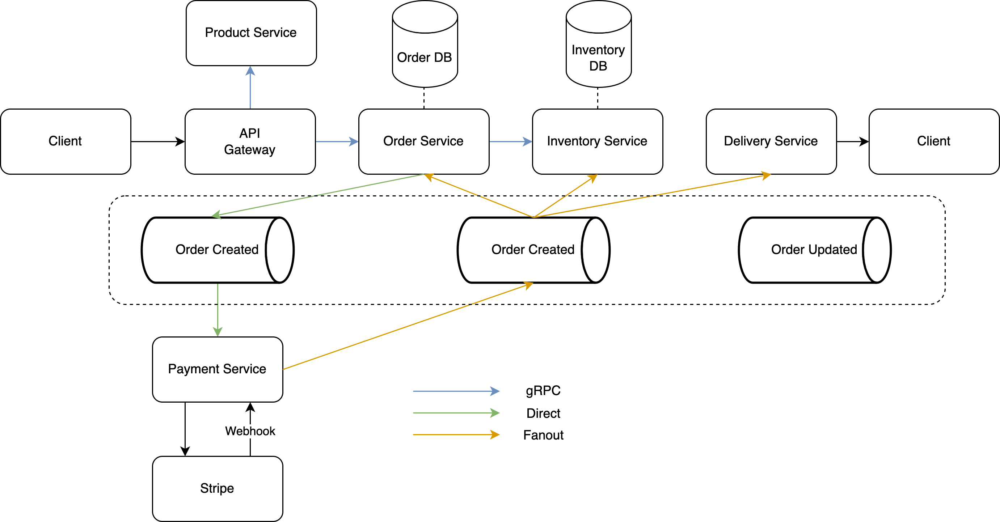

## Order Management System (Microservice)



### Installation
```bash
cd {service}
go mod init github.com/naufalihsan/{service}
go work init ./{service}
go install github.com/cosmtrek/air@latest
```

### FAQs
- Why using gRPC?
    ```
    - Low Latency
    - Strongly typed contracts between the services
    - Protocol buffers > JSON
    ```
- How Consul Works in a Microservice Architecture?
    ```
    - Service Registration: Each service instance registers itself with Consul when it starts up. This can be done through a Consul agent that runs alongside the service.
    - Service Discovery: When a service needs to communicate with another service, it queries Consul to find the instances of the target service. Consul responds with the addresses of healthy instances.
    - Health Checks: Consul performs health checks on registered services to ensure they are functioning correctly. If a service fails a health check, it is removed from the list of available services.
    - Configuration Management: Services can read their configuration from the Consul key/value store. This allows for centralized management of configuration data, which can be updated dynamically without restarting the services.
    - Security and Segmentation: Consul enforces access control policies to ensure that only authorized services can communicate with each other, enhancing the security of the microservice architecture.
    ```